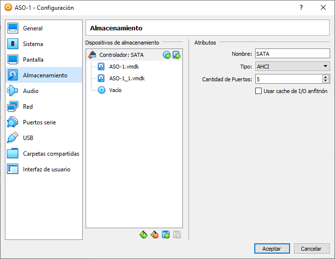
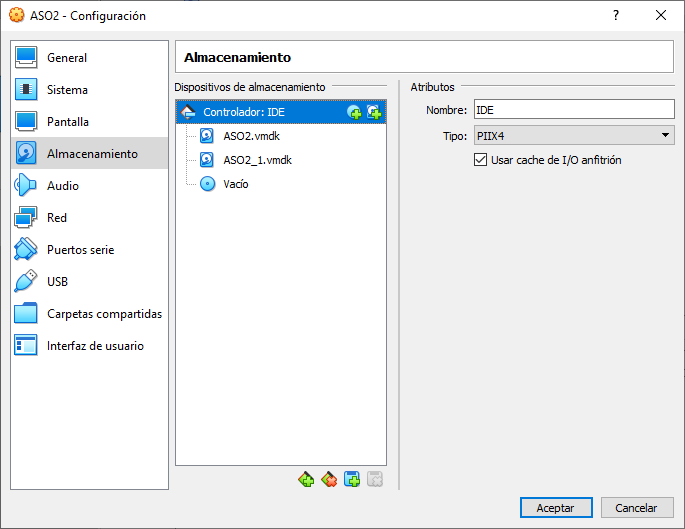

# Practica 7 - ASO

## MAQUINA 1

### VirtualBox
Añadimos el disco a la máquina ASO1:
- Configuración
  - Almacenamiento
    - Controlador: IDE (o SATA) -> Agregar
      - Crear
        - Modo experto
          - Tamaño de archivo *1,00 GB*
          - Tipo de archivo de disco duro *VMDK (Virtual Machine Disk)*
          - Almacenamiento en disco duro *Reservado dinámicamente*
      - Seleccionamos *ASO1_1.vmdk*
      - Seleccionar
  - Aceptar

El resultado debería ser



Creamos la partición FAT desde *Devuan*.

Debido a que cada sistema operativo tiene un criterio diferente de formato y
alineación, puede existir espacio libre entre particiones. En la práctica 1,
decidimos instalar primero Solaris, que deja un espacio de 16064 sectores
desde el comienzo del disco hasta su partición.

Si utilizamos *fdisk*, y no especificamos nada en el inicio de la partición,
toma el primer espacio libre que encuentra. En nuestro caso, detecta este espacio
libre, por lo que es necesario especificar manualmente el lugar de inicio.
Para calcularlo, ejecutamos `fdisk -l`, y escogemos el valor de *end*+1 de la
última partición, siempre que estén ordenadas. Finalmente, formateamos y creamos
el sistema de fichero. Hemos automatizado este proceso entero en un script.

Alternativamente, podemos crear la partición desde *Solaris*, que la coloca
automáticamente en el espacio libre al final del disco.

### Devuan
```bash
#!/bin/bash

set -e

DISK="/dev/sda"

echo "Buscando espacio libre al final del disco"
PARTITION_ENDS=$(\
`# Obtenemos las posiciones de las particiones con fdisk` \
fdisk -l /dev/sda \
`# Busca el header de fdisk y muestra las 10 lineas siguientes` \
| grep -EA10 "^Device\s+Boot\s+Start\s+End\s+Sectors\s+Size\s+Id\s+Type$" \
`# Elimina el header de fdisk` \
| tail -n+2 \
`# Elimina espacios y el asterisco de boot (para que coincidan las columnas)` \
| tr -d '\*' | tr -s '[:blank:]' ' ' \
`# Obtiene la tercera columna (end)` \
| cut -d " " -f3 )

# Obtiene el offset mayor (si hay particiones desordenadas)
# Suma uno para obtener el primer sector libre
FREE_SPACE_SECTOR=$(echo "${PARTITION_ENDS[*]}"| sort -nr | head -n1)
((FREE_SPACE_SECTOR++))

# Creamos particion en el espacio libre. Especificando 100% alinea automaticamente
# con el criterio especificado (-a). Opciones: none, minimal, cylinder, optimal
echo "Crear partición primaria fat32 en /dev/sda ${FREE_SPACE_SECTOR}s - 100%"
parted -a optimal /dev/sda mkpart primary fat32 ${FREE_SPACE_SECTOR}s 100%

# La particion nueva es la ultima
PARTITION=$(fdisk -l /dev/sda `# Lista particiones disco`\
| tail -n 1 `# Separa linea ultima particion`\
| cut -d " " -f1 `# Escoge primera columna separada por espacio (/dev/sd..)`\
| tr -d " \n" `# Elimina espacios y newlines sobrantes`)

# Creamos el sistema de ficheros
echo "Creando sistema de ficheros en $PARTITION"
# fat32 es vfat
mkfs.vfat $PARTITION

# Creamos el punto de montaje y montamos
MOUNT_POINT="/data1"
echo "Montando $PARTITION en $MOUNT_POINT"
mkdir "$MOUNT_POINT"
mount $PARTITION "$MOUNT_POINT"

# Obtenemos el uuid de la particion que acabamos de crear
PART_UUID=$(blkid -s UUID -o value $PARTITION)

# Actualizamos fstab
echo "UUID=$PART_UUID   $MOUNT_POINT    vfat    0   0" >> /etc/fstab
```

### Solaris 10

### OpenBSD 6.8

## MAQUINA 2
### VirtualBox
Añadimos el disco a la máquina ASO2:
- Configuración
  - Almacenamiento
    - Controlador: IDE -> Agregar
      - Crear
        - Modo experto
          - Tamaño de archivo *4,00 GB*
          - Tipo de archivo de disco duro *VMDK (Virtual Machine Disk)*
          - Almacenamiento en disco duro *Reservado dinámicamente*
      - Seleccionamos *ASO2_1.vmdk*
      - Seleccionar
  - Aceptar

El resultado debería ser


### FreeBSD
Comenzaremos primero por FreeBSD.

Instalamos gdisk para editar la tabla de particiones:
```bash
pkg install -y gdisk
```

Tras esto ejecutamos
```bash
gdisk /dev/ada1
```
y procedemos con los siguientes inputs
- **o** (**Y**es)
- **n**
  - \<ENTER\> (Partition number 1)
  - \<ENTER\> (First sector 2048)
  - +2GB
  - \<ENTER\> (A503 FreeBSD UFS)
- **n**
  - \<ENTER\> (Partition number 2)
  - \<ENTER\> (First sector 4196352)
  - \<ENTER\> (Last sector 8388574)
  - 8300 (Linux filesystem)
- **w** (**Y**es)
  
Ante el aviso que nos arroja ejecutamos
```bash
reboot
```

Tras reiniciar, ya se nos debería auto crear los archivos `/dev/ada1p1` y `/dev/ada1p2`. El primero lo formatearemos en FreeBSD UFS.
```bash
newfs /dev/ada1p1
```

Tras esto volvemos a reiniciar, esta vez a fedora, ya que por el momento, hemos terminado.

### Fedora
TEST

## MAQUINA 3
### Solaris 11

### Ubuntu
